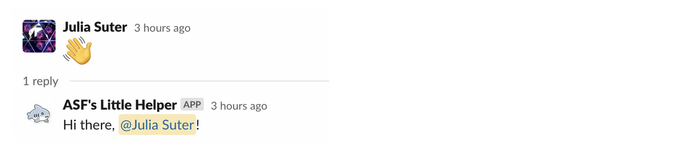
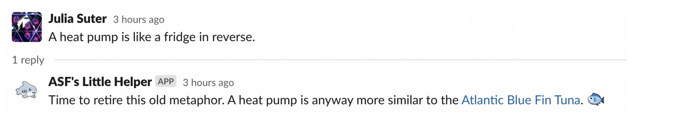
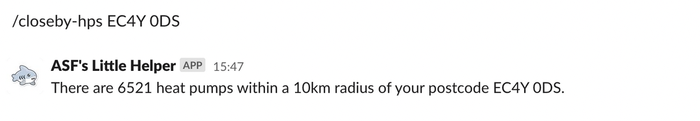
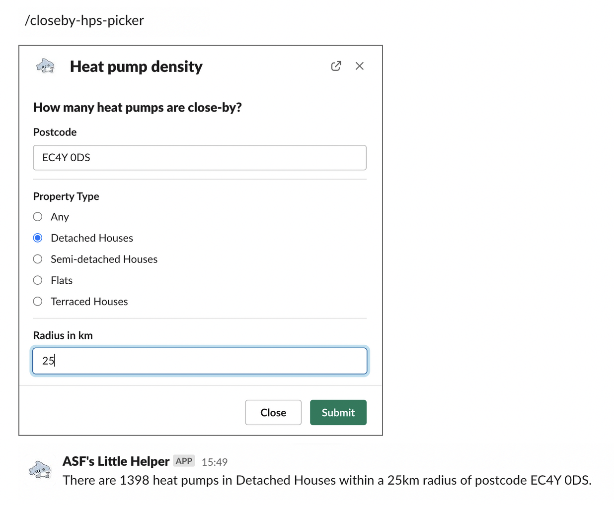
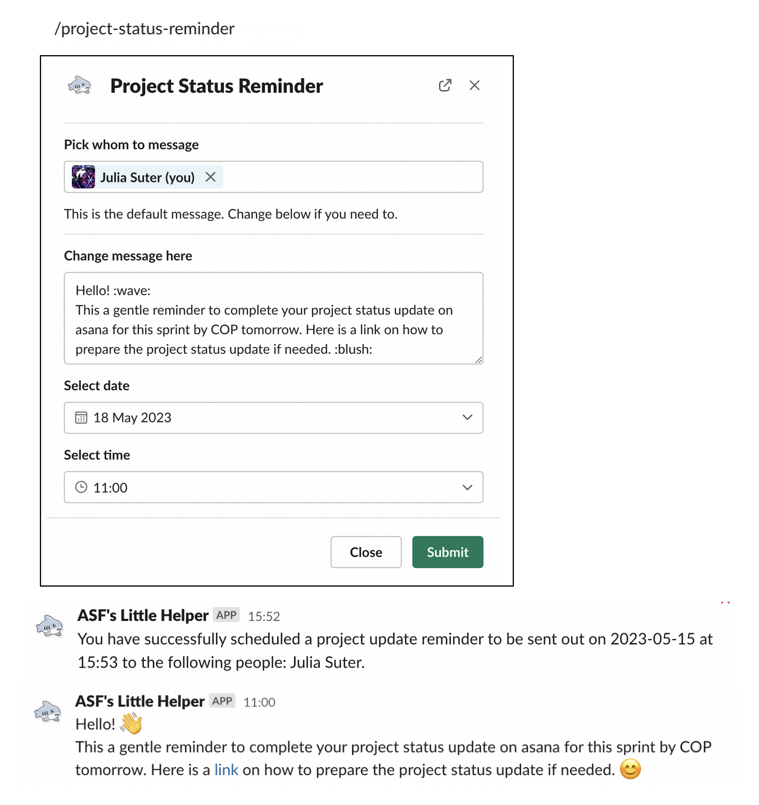
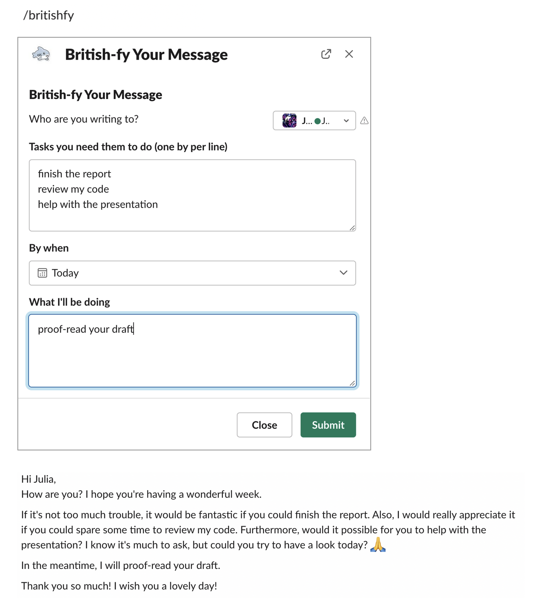

# A Sustainable Slackbot 

## Table of Content<a id='top'></a>

- [A slackbot for ASF](#intro)
- [Examples](#examples)
- [How to run](#run)
- [How to build your own slackbot](#build)

## A slackbot for A Sustainable Future at Nesta<a id='intro'></a>
[[back to top]](#top)

This repo contains code to run a slackbot named _ASF's Little Helper_, which represents our very first attempt at developing a specialised slackbot for Nesta.  

The slackbot includes following functionality:

- It greets everyone who sends a wave emoji
- It offers an alternative to the _fridge in reverse_ metaphor for heat pumps.

It also provides the following slash commands:

- `/tell-me-a-joke [topic]` tells a dad joke
- `/hp-closeby [postcode]` returns the number of heat pumps within a 10km radius of the given postcode
- `/hp-closeby-picker` opens a pop-up window which lets the user select the postcode, property type and radius before computing the number of heat pump in the vicinity
- `/project-status-reminder` helps the team coordinator send and keep track of reminders
- `/britishfy` generates a "British style" message to a colleague asking for specific tasks


## Examples <a id='examples'></a>
[[back to top]](#top)














## How to run<a id='run'></a>
[[back to top]](#top)

```
git clone https://github.com/nestauk/asf_exploration.git

cd asf_slackbot
conda create -n asf_slackbot
conda activate asf_slackbot

pip install --upgrade pip
pip install -r requirements.txt

python asf_little_helper.py
```

Wait for the message _Bolt app is running!_ to appear in your terminal. 

Naturally, the script needs to be running for the chatbot to work, so eventually we hope to run it permanentely on a server. For now, a temporary fix is to run it on a computer when developing, testing and demonstrating the slackbot.

## How to build your own slackbot<a id='build'></a>
[[back to top]](#top)

Please refer to the tips and tricks in [this document](https://docs.google.com/document/d/1V2nQHTxln3kKjJBNcxhLpH07eYNb1ly-ls0otU1JEmY/edit#). 
